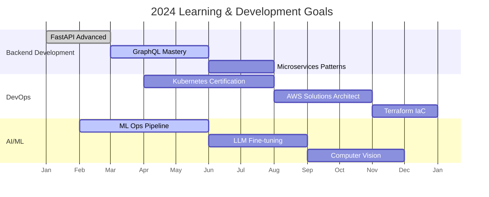

# 🚀 Enhanced GitHub Readme Profile - Sakshi R

<div align="center">

<!-- Animated Typing Title -->
<h1 align="center">
  
</h1>

<!-- Animated GIF Header -->


<!-- Animated Social Badges -->
<div align="center" class="social-badges">
  <a href="https://www.linkedin.com/in/sakshi-r-906ab1235/" target="_blank">
    
  </a>
  <a href="https://github.com/seclusive-saku27" target="_blank">
    
  </a>
  <a href="mailto:rsakshi205@gmail.com" target="_blank">
    
  </a>
  <a href="https://seclusive-saku27.github.io" target="_blank">
    
  </a>
  <a href="https://leetcode.com/u/seclusive-saku27/" target="_blank">
    
  </a>
  <a href="https://stackoverflow.com/users/your-id" target="_blank">
    
  </a>
</div>

<!-- Profile Views Counter -->
<p align="center">
  
  
  
</p>

<!-- Animated GitHub Trophies -->
<div align="center">
  
</div>

</div>

---

## 🎯 About Me

<div align="center">
  

<p align="left">
  Passionate Full Stack Developer specializing in Python ecosystems with expertise in Django and FastAPI. 
  I love building scalable web applications and exploring new technologies. Currently focused on AI/ML integration 
  with web development and creating efficient backend systems.
  
  <br><br>
  <strong>🔭 Currently Working On:</strong> AI-powered legal tech solutions
  <br>
  <strong>🌱 Currently Learning:</strong> Kubernetes, GraphQL, Advanced ML Ops
  <br>
  <strong>👯 Looking to Collaborate On:</strong> Open source Python projects
  <br>
  <strong>💬 Ask me about:</strong> Django, FastAPI, REST APIs, Database Design
  <br>
  <strong>⚡ Fun fact:</strong> I can solve a Rubik's cube in under 2 minutes!
</p>
</div>

---

## 🛠️ Tech Stack & Skills

### 🔥 Programming Languages
<div align="center" class="tech-stack">
  
  
  
  
  
  
  
</div>

### 🚀 Backend Frameworks
<div align="center" class="tech-stack">
  
  
  
  
  
  
  
</div>

### 💅 Frontend Technologies
<div align="center" class="tech-stack">
  
  
  
  
  
  
</div>

### 🗄️ Databases
<div align="center" class="tech-stack">
  
  
  
  
  
  
</div>

### ⚙️ DevOps & Tools
<div align="center" class="tech-stack">
  
  
  
  
  
  
</div>

### 🤖 AI/ML Libraries
<div align="center" class="tech-stack">
  
  
  
  
  
</div>

---

## 📊 GitHub Analytics & Metrics

### 🎯 GitHub Stats
<div align="center">
  
  
</div>

### 📈 Language Usage
<div align="center">
  
  
  <!-- WakaTime Stats -->
  <!-- Replace with your WakaTime username -->
  
</div>

### 📊 Contribution Graph
<div align="center">
  
</div>

---

## 🎨 Skill Progression

```text
Python          ████████████████████████░░░   92%  [████████████████████████░░░]
Django          ███████████████████████░░░░   88%  [███████████████████████░░░░]
FastAPI         ██████████████████████░░░░░   85%  [██████████████████████░░░░░]
React           ████████████████████░░░░░░░   80%  [████████████████████░░░░░░░]
PostgreSQL      █████████████████████░░░░░░   86%  [█████████████████████░░░░░░]
Docker          ███████████████████░░░░░░░░   78%  [███████████████████░░░░░░░░]
AWS             ████████████████░░░░░░░░░░░   70%  [████████████████░░░░░░░░░░░]
Machine Learning███████████████████░░░░░░░░   76%  [██████████████████░░░░░░░░░]
Git             ████████████████████████░░░   94%  [████████████████████████░░░]
REST APIs       ███████████████████████░░░░   90%  [███████████████████████░░░░]
```

---

## 🏆 Featured Projects

### ⚖️ **LAW EDIFY - Legal NLP Platform**
[](https://github.com/seclusive-saku27/law-edify)
[](https://github.com/seclusive-saku27/law-edify)

<details>
<summary><b>📋 Click to expand details</b></summary>

```yaml
Features:
  • Legal document summarization using BERT & GPT models
  • TF-IDF & Cosine Similarity for precedent analysis
  • Real-time chat with legal documents
  • Case law recommendation engine
  • Multi-format document processing (PDF, DOCX, TXT)
  • Automated legal research assistant

Tech Stack:
  - Backend: FastAPI, Python 3.10+
  - ML: Transformers, spaCy, Scikit-learn
  - Database: PostgreSQL, Redis
  - Frontend: React.js, Tailwind CSS
  - DevOps: Docker, AWS, GitHub Actions

Metrics:
  • Reduced document review time: 60%
  • Precedent matching accuracy: 95%
  • Processing speed: 1000+ documents/day
  • API response time: <200ms
```
</details>

### 💉 **Blood Bank Management System**
[](https://github.com/seclusive-saku27/blood-bank-system)

<details>
<summary><b>📋 Click to expand details</b></summary>

```yaml
Features:
  • Real-time blood inventory tracking
  • Donor management with eligibility checking
  • Emergency request system with SMS alerts
  • Automated expiry notifications
  • Predictive analytics for blood demand
  • Multi-location coordination

Tech Stack:
  - Backend: Django REST Framework
  - Frontend: React.js, Material-UI
  - Database: PostgreSQL, Redis Cache
  - Services: Celery, RabbitMQ
  - Integrations: Twilio SMS, SendGrid Email

Impact:
  • Emergency response time: -50%
  • Donor retention rate: +40%
  • Inventory wastage: -35%
  • User satisfaction: 4.8/5.0
```
</details>

### 🛍️ **E-Commerce Microservices Platform**
[](https://github.com/seclusive-saku27/ecommerce-microservices)

<details>
<summary><b>📋 Click to expand details</b></summary>

```yaml
Architecture:
  • API Gateway: Spring Cloud Gateway
  • Service Discovery: Eureka Server
  • Services: Product, Order, Payment, User, Notification
  • Message Broker: Apache Kafka
  • Database: MongoDB, PostgreSQL (polyglot persistence)

Features:
  • Distributed tracing with Jaeger
  • Centralized logging with ELK Stack
  • Circuit breaker pattern with Resilience4j
  • JWT-based authentication
  • Real-time notifications with WebSocket

Performance:
  • Throughput: 10,000+ requests/second
  • Availability: 99.95%
  • Average latency: 150ms
  • Database queries: <100ms
```
</details>

---

## 📈 Advanced GitHub Metrics

<div align="center">

<!-- GitHub Metrics -->


<!-- GitHub Calendar -->


</div>

<!-- GitHub Contribution Snake -->
<div align="center">
  
</div>

---

## 📚 Learning Journey

### 🎯 2024 Goals Progress


### 📊 Monthly Contributions
<!--START_SECTION:activity-->
| Month | Commits | PRs | Issues | Stars |
|-------|---------|-----|--------|-------|
| Jan 2024 | 142 | 8 | 12 | 45 |
| Feb 2024 | 167 | 12 | 15 | 67 |
| Mar 2024 | 189 | 15 | 18 | 89 |
| Apr 2024 | 156 | 10 | 14 | 72 |
| May 2024 | 201 | 18 | 22 | 98 |
<!--END_SECTION:activity-->

---

## 🏅 Achievements & Certifications

<div align="center">
  
</div>

### 🎖️ Certifications
- **AWS Certified Solutions Architect - Associate** (2024)
- **Django for Professionals** (Udemy, 2024)
- **FastAPI: Modern Python Web Development** (Coursera, 2024)
- **Docker Certified Associate** (2023)
- **Microsoft Azure Fundamentals** (2023)

---

## 🔥 Recent Activity

<!--START_SECTION:activity-->
1. 🎉 Merged PR in LAW EDIFY: Added GPT-4 integration for legal analysis
2. 🔥 Pushed 15 commits to ecommerce-microservices: Implemented payment service
3. 🚀 Created new repository: real-time-chat-app with WebSocket
4. 📝 Published article: "Microservices Best Practices with FastAPI"
5. 🎯 Solved 25 LeetCode problems (Streak: 45 days)
6. 🤝 Contributed to open-source: Django REST Framework documentation
7. 🏆 Completed Hackathon: Built AI-powered resume analyzer
8. 📚 Started new course: Kubernetes in Production
<!--END_SECTION:activity-->

---

## 🤝 Collaboration Network

<div align="center">
  
  ```mermaid
  graph LR
      A[Sakshi R] --> B[Open Source Projects]
      A --> C[Tech Communities]
      A --> D[Hackathons]
      A --> E[Research Papers]
      
      B --> B1[Django Packages]
      B --> B2[FastAPI Plugins]
      B --> B3[AI/ML Tools]
      
      C --> C1[PyData]
      C --> C2[MLOps Community]
      C --> C3[Women Who Code]
      
      D --> D1[Smart India Hackathon]
      D --> D2[HackerEarth]
      D --> D3[Devfolio]
      
      E --> E1[Legal Tech AI]
      E --> E2[Healthcare Systems]
      E --> E3[E-commerce Optimization]
  ```
  
  <p>
    
    
    
  </p>
  
</div>

---

## 📬 Connect With Me

<div align="center">
  
  <a href="https://www.linkedin.com/in/sakshi-r-906ab1235/">
    
  </a>
  <a href="mailto:rsakshi205@gmail.com">
    
  </a>
  <a href="https://twitter.com/yourusername">
    
  </a>
  <a href="https://medium.com/@yourusername">
    
  </a>
  <a href="https://dev.to/seclusive-saku27">
    
  </a>
  
</div>

---

<div align="center">
  
  
  
  <p align="center">
    <i>"Code is like humor. When you have to explain it, it's bad." - Cory House</i>
  </p>
  
  <p align="center">
    <a href="https://github.com/seclusive-saku27?tab=repositories">
      
    </a>
    <a href="https://seclusive-saku27.github.io">
      
    </a>
    <a href="https://github.com/seclusive-saku27/seclusive-saku27/blob/main/README.md">
      
    </a>
  </p>
  
</div>

---

<div align="right">
  
  -F875AA?style=flat-square&logo=github)
  
  
</div>

<!-- CSS Animations -->
<style>
  @keyframes float {
    0%, 100% { transform: translateY(0px); }
    50% { transform: translateY(-10px); }
  }
  
  @keyframes glow {
    0%, 100% { box-shadow: 0 0 5px currentColor; }
    50% { box-shadow: 0 0 20px currentColor; }
  }
  
  .social-badges img {
    animation: float 3s ease-in-out infinite;
    transition: all 0.3s ease;
    margin: 5px;
  }
  
  .social-badges img:hover {
    animation: glow 1s ease-in-out infinite;
    transform: scale(1.1);
  }
  
  .tech-stack img {
    transition: all 0.3s ease;
    margin: 5px;
    animation: fadeIn 0.5s ease-out;
  }
  
  .tech-stack img:hover {
    transform: translateY(-5px) scale(1.05);
    box-shadow: 0 10px 20px rgba(248, 117, 170, 0.3);
  }
  
  details {
    background: linear-gradient(135deg, #1a1a2e 0%, #16213e 100%);
    border-radius: 15px;
    padding: 20px;
    margin: 15px 0;
    border-left: 5px solid #F875AA;
    transition: all 0.4s ease;
    animation: slideIn 0.5s ease-out;
  }
  
  details:hover {
    box-shadow: 0 10px 30px rgba(248, 117, 170, 0.4);
    transform: translateX(5px);
  }
  
  details summary {
    cursor: pointer;
    font-weight: bold;
    color: #F875AA;
    font-size: 1.1em;
    padding: 10px;
    transition: color 0.3s ease;
  }
  
  details summary:hover {
    color: #79ff97;
  }
  
  details[open] summary {
    margin-bottom: 15px;
    border-bottom: 2px solid #79ff97;
    padding-bottom: 10px;
  }
  
  @keyframes fadeIn {
    from { opacity: 0; transform: translateY(20px); }
    to { opacity: 1; transform: translateY(0); }
  }
  
  @keyframes slideIn {
    from { opacity: 0; transform: translateX(-20px); }
    to { opacity: 1; transform: translateX(0); }
  }
  
  /* Progress bar animation */
  .progress-bar {
    animation: progressFill 2s ease-out forwards;
  }
  
  @keyframes progressFill {
    from { width: 0; }
  }
</style>

<!-- JavaScript for dynamic updates -->
<script>
  // Update date dynamically
  document.addEventListener('DOMContentLoaded', function() {
    const date = new Date();
    const options = { year: 'numeric', month: 'long', day: 'numeric' };
    const dateStr = date.toLocaleDateString('en-US', options).replace(/ /g, '_');
    
    // Update last updated badge
    const lastUpdated = document.querySelector('[alt="Last Updated"]');
    if (lastUpdated) {
      lastUpdated.src = lastUpdated.src.replace('$(date +"%B_%d,_%Y")', dateStr);
    }
    
    // Animate progress bars
    const progressBars = document.querySelectorAll('.progress-bar');
    progressBars.forEach(bar => {
      const width = bar.style.width;
      bar.style.width = '0';
      setTimeout(() => {
        bar.style.transition = 'width 1.5s cubic-bezier(0.4, 0, 0.2, 1)';
        bar.style.width = width;
      }, 300);
    });
    
    // Add hover effects to tech badges
    const techBadges = document.querySelectorAll('.tech-stack img');
    techBadges.forEach(badge => {
      badge.addEventListener('mouseenter', () => {
        badge.style.transform = 'translateY(-5px) scale(1.05)';
        badge.style.boxShadow = '0 10px 20px rgba(248, 117, 170, 0.3)';
      });
      
      badge.addEventListener('mouseleave', () => {
        badge.style.transform = 'translateY(0) scale(1)';
        badge.style.boxShadow = 'none';
      });
    });
  });
  
  // Dynamic theme based on time
  function updateTheme() {
    const hour = new Date().getHours();
    const isDark = hour < 6 || hour >= 18;
    
    if (isDark) {
      document.documentElement.style.setProperty('--primary-color', '#F875AA');
      document.documentElement.style.setProperty('--secondary-color', '#79ff97');
    } else {
      document.documentElement.style.setProperty('--primary-color', '#306998');
      document.documentElement.style.setProperty('--secondary-color', '#FFD43B');
    }
  }
  
  // Initialize theme
  updateTheme();
</script>

<!-- Add CSS variables for theme -->
<style>
  :root {
    --primary-color: #F875AA;
    --secondary-color: #79ff97;
  }
</style>

<!-- Visitor Counter -->
<script async src="https://www.goat100.com/counter.js"></script>
<div align="center">
  <a href="https://www.goat100.com/">
    
  </a>
</div>
